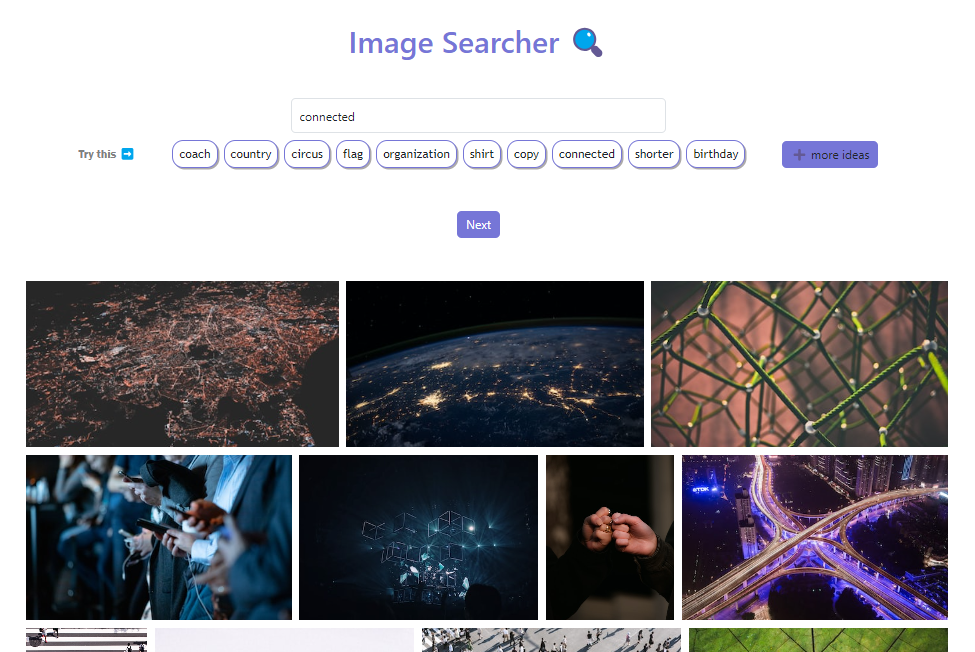

# Buscador de Imágenes

Este proyecto es un buscador de imágenes que te permite realizar búsquedas de imágenes a través de una API y obtener una lista de palabras aleatorias para inspirarte en tus búsquedas.



## Características

- Realiza búsquedas de imágenes utilizando palabras clave.
- Obtiene una lista de palabras aleatorias para inspirarte.
- Muestra una galería de imágenes relacionadas con la palabra clave ingresada.
- Interfaz de usuario amigable y fácil de usar.

## Tecnologías utilizadas

- Vite: [Vite](https://vitejs.dev/) es un entorno de desarrollo ultrarrápido para aplicaciones web basadas en JavaScript.
- React: [React](https://reactjs.org/) es una biblioteca de JavaScript para construir interfaces de usuario.
- Unsplash API: [Unsplash API](https://unsplash.com/developers) es una API que proporciona acceso a una vasta colección de imágenes gratuitas de alta calidad.

## Cómo ejecutar el proyecto

1. Clona este repositorio en tu máquina local.

```bash
git clone https://github.com/GuilloSGit/unsplash_image_searcher.git
cd [nombre_de_tu_carpeta]
```

2. Instala las dependencias.

```bash
npm install
```

3. Obtén una API Key de Unsplash

Para utilizar la API de Unsplash, necesitas obtener una API Key. Puedes registrarte en Unsplash Developers para obtenerla de forma gratuita.

4. Configura tu API Key

Crea un archivo .env en la raíz del proyecto y agrega tu API Key. Mira el ejemplo del archivo [.env](.envexample).

5. Ejecuta el proyecto en modo de desarrollo.

```bash
npm run dev
```

6. Abre tu navegador y visita <http://localhost:3000> para ver el buscador de imágenes en acción.

## Contribuciones

Si deseas contribuir a este proyecto, eres bienvenido(a) de hacerlo. Puedes abrir un issue o enviar un pull request con tus mejoras o correcciones.

## Licencia

Este proyecto está bajo la [MIT License](LICENSE).
